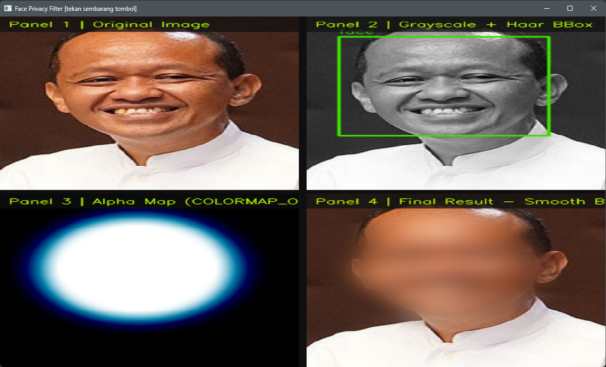
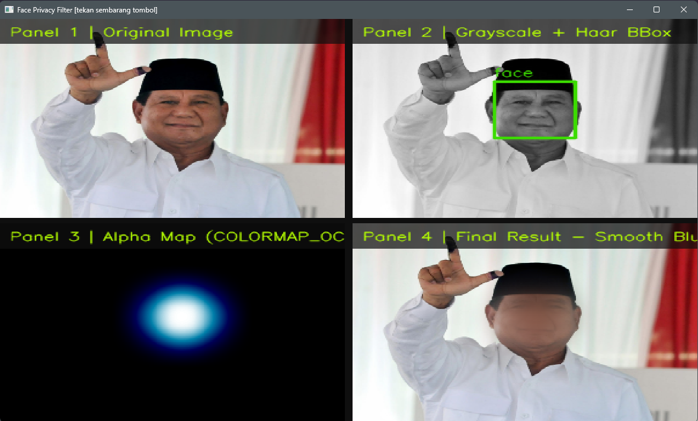
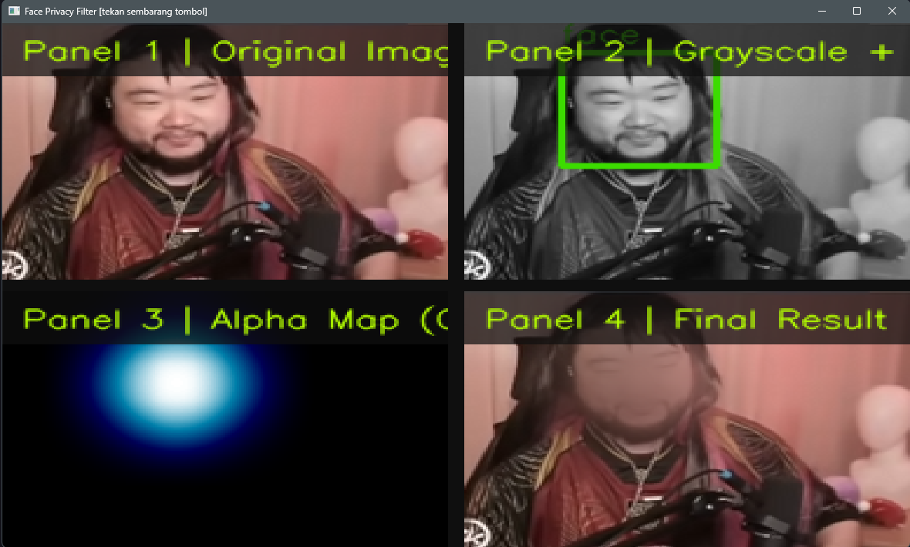
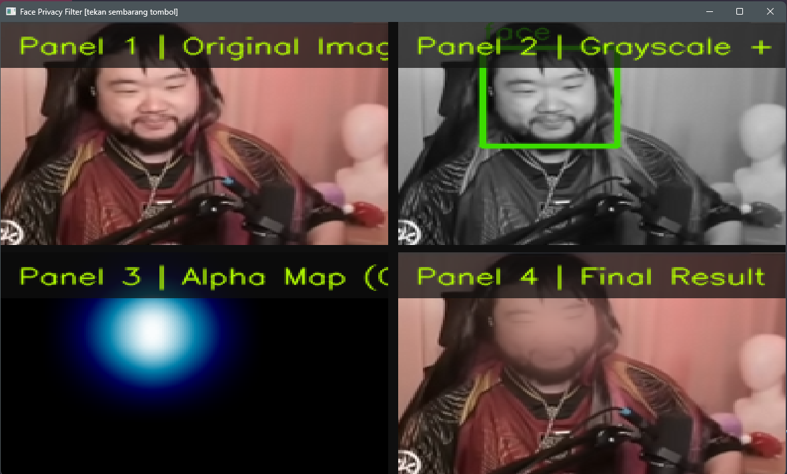
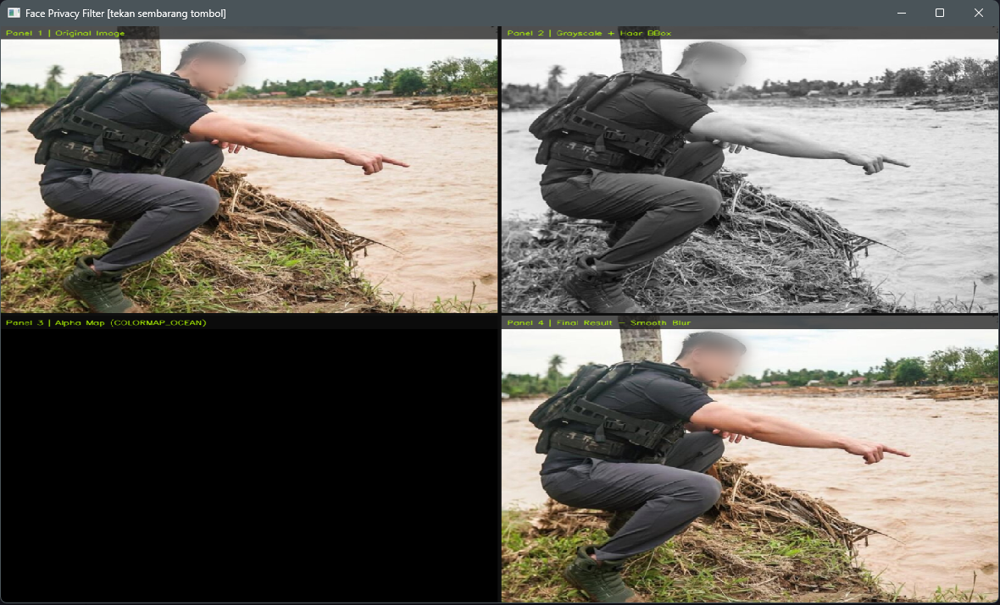

<div align="center">

# Face Privacy Filter

**Proyek Akhir — Pemrosesan Citra Digital**

Aplikasi proteksi privasi wajah berbasis Python menggunakan *Multiscale Haar Cascade Detection* dan *Alpha Blending* untuk menghasilkan efek sensor yang halus dan natural.


</div>

---

## Deskripsi

**Face Privacy Filter** mendeteksi wajah secara otomatis pada gambar maupun video menggunakan dua model **Haar Cascade** bawaan OpenCV — satu untuk wajah frontal, satu untuk wajah profil samping — lalu menerapkan sensor berbasis *Alpha Blending* yang menghasilkan transisi gradual antara area wajah yang diblur dan latar belakang asli, tanpa tepi piksel yang terlihat kasar.

Pipeline deteksi menggunakan tiga jalur secara bersamaan: wajah depan, profil kiri, dan profil kanan (via *horizontal mirror*), sehingga wajah yang tidak menghadap kamera pun tetap terdeteksi. Hasil gabungan ketiga jalur difilter menggunakan **IoU-based Overlap Suppression** agar satu wajah tidak diblur dua kali oleh classifier yang berbeda.

---


## Penjelasan Alur

| No | Tahap | Detail Implementasi |
|---|---|---|
| **1** | **Input** | GUI Tkinter `filedialog` — memilih file gambar atau video. Loop otomatis menawarkan proses file berikutnya setelah selesai. |
| **2** | **Preprocessing** | Frame dikonversi BGR → Grayscale → `cv2.equalizeHist()` untuk meningkatkan kontras sebelum deteksi. |
| **3** | **Detection (3-way Haar)** | `haarcascade_frontalface_default` untuk wajah depan; `haarcascade_profileface` untuk profil kiri; cascade yang sama dijalankan pada frame *horizontal flip* lalu koordinat dikembalikan untuk profil kanan. |
| **4** | **IoU Suppression** | Semua deteksi dari tiga jalur digabung, lalu box yang tumpang tindih melebihi ambang `IoU = 0.40` dihapus — box dengan area lebih besar dipertahankan. |
| **5** | **Ellipse Masking** | Kanvas hitam dibuat, lalu `cv2.ellipse(FILLED)` digambar untuk setiap wajah. Pusat elips digeser 5% ke bawah agar menutupi dagu secara proporsional. |
| **6** | **Feathering** | Masker elips dihaluskan tepinya dengan `cv2.GaussianBlur(kernel=51)`, menghasilkan gradasi halus dari area tersensor ke area asli. |
| **7** | **Alpha Blending** | Mask dinormalisasi ke `float [0.0–1.0]` sebagai bobot `α`. Frame asli di-blur terpisah dengan kernel besar (`kernel=125`). Keduanya digabung piksel-per-piksel: `Result = α × Blur + (1−α) × Original`. |
| **8** | **Output** | File disimpan otomatis dengan sufiks `_filtered` di direktori yang sama dengan input. |

### Formula Alpha Blending

```
Output(x, y) = α(x,y) × Blurred(x,y)  +  (1 − α(x,y)) × Original(x,y)
```

> `α(x, y) ∈ [0.0, 1.0]` adalah nilai *feathered mask* pada koordinat piksel `(x, y)`. Nilai `1.0` berarti sepenuhnya blur; nilai `0.0` berarti citra asli utuh.

---

## Visualisasi Output

### Gambar Statis — 4-Panel Dashboard

Saat memproses gambar (`.jpg` / `.png`), program menampilkan satu jendela berisi **grid 2×2**:

| Panel | Label Kode | Konten |
|---|---|---|
| **1** | `Panel 1 \| Original Image` | Frame asli tanpa modifikasi |
| **2** | `Panel 2 \| Grayscale + Haar BBox` | Grayscale + bounding box hijau per wajah terdeteksi |
| **3** | `Panel 3 \| Alpha Map (COLORMAP_OCEAN)` | Feathered mask divisualisasikan sebagai heatmap warna OCEAN |
| **4** | `Panel 4 \| Final Result - Smooth Blur` | Output akhir: citra tersensor dengan gradasi halus |

### Video — Dual Window Real-time

Saat memproses video (`.mp4` / `.avi`), program menampilkan **dua jendela terpisah** secara real-time:

- **Jendela Detection** — Grayscale + bounding box (Panel 2)
- **Jendela Result** — Hasil akhir blur (Panel 4)

Tekan `q` untuk menghentikan pemrosesan video lebih awal.

---

## Instalasi & Penggunaan

```bash
# Install dependencies
pip install opencv-python numpy

# Jalankan program
python img_filter.py
```

> `tkinter` sudah tersedia secara bawaan dalam instalasi standar Python. Haar Cascade XML disertakan langsung dalam paket `opencv-python`.

**Format yang didukung:** `.jpg` `.jpeg` `.png` `.mp4` `.avi`

**Output:** Disimpan otomatis di direktori yang sama dengan file input, dengan sufiks `_filtered`.
Contoh: `foto.jpg` → `foto_filtered.jpg` | `video.mp4` → `video_filtered.mp4`

---

##  Hasil

> **Tentang folder `result/`:** Folder ini adalah **repositori referensi kualitas** yang menyimpan contoh-contoh hasil pemrosesan yang pernah dilakukan. Ini bukan direktori output program — file output selalu disimpan di lokasi yang sama dengan file input sumber.

|  |
|  |
|  |
|  |
|  |
