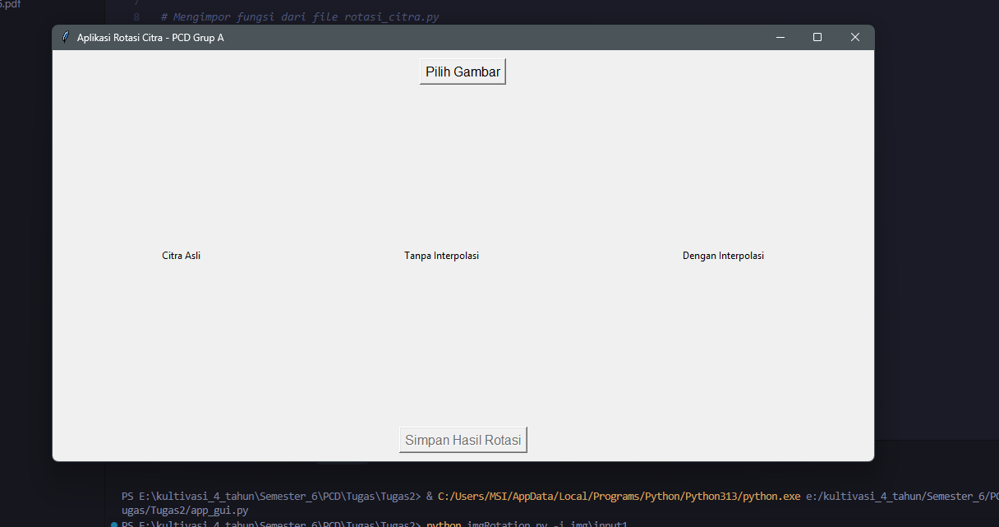
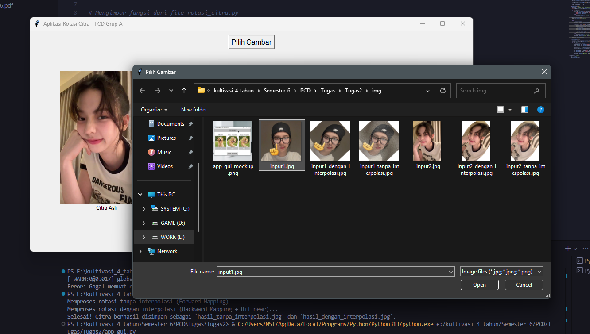
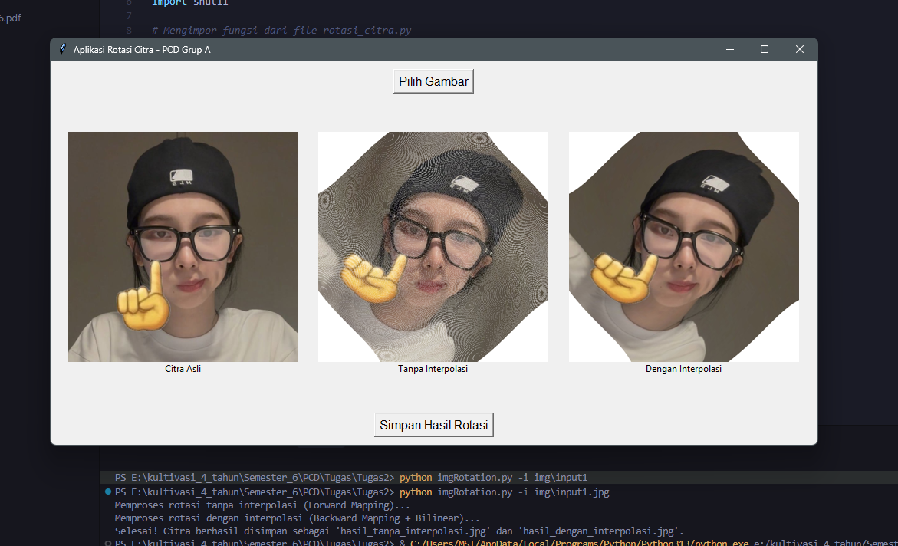
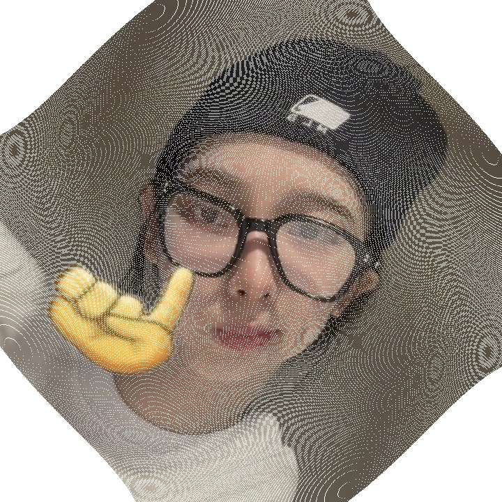
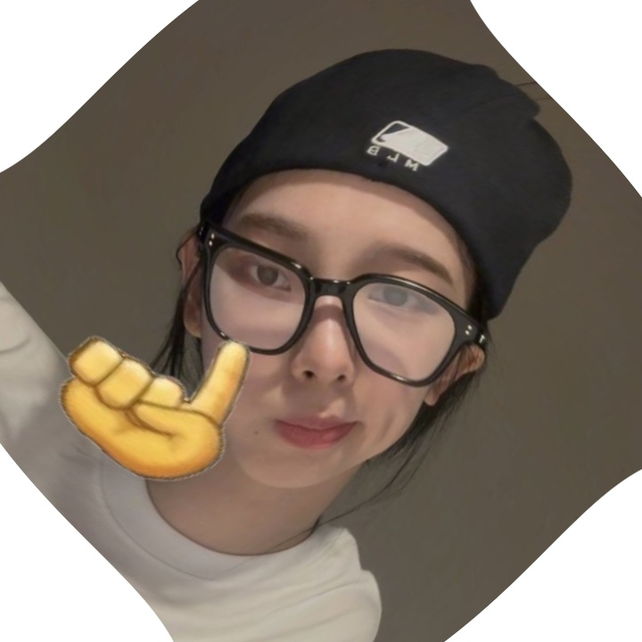

# Tugas 2 Pengolahan Citra Digital — Rotasi Citra dengan Efek Swirl

> **Mata Kuliah:** Pengolahan Citra Digital — Grup A  
> **Dosen Pengampu:** Aditya Wikan Mahastama  

---

## 📋 Rangkuman Tugas

Program ini mengimplementasikan **Rotasi Citra dengan Efek *Swirl*** (*melintir*), yakni sebuah efek distorsi di mana setiap piksel diputar dengan sudut yang bergantung pada jaraknya dari pusat citra — sehingga menghasilkan tampilan seperti pusaran/uliran.

### Konsep Utama

| Konsep | Penjelasan |
|---|---|
| **Titik Pusat Rotasi** | Tengah citra (`cx`, `cy`) |
| **Rumus Sudut Rotasi** | `θ = d(P, centre) / 8` (dalam derajat), di mana `d` adalah jarak piksel ke pusat |
| **Arah Rotasi** | Searah jarum jam |
| **Batas Ukuran Input** | Maksimal 720×720 piksel (otomatis di-*resize* jika lebih besar) |

### Dua Mode Pemrosesan

1. **Rotasi Tanpa Interpolasi** — menggunakan *forward mapping*: setiap piksel sumber dipetakan ke posisi barunya. Piksel yang tidak terpetakan dibiarkan kosong (putih).

2. **Rotasi Dengan Interpolasi** — menggunakan *backward mapping* dengan **interpolasi bilinear** via `cv2.remap`. Untuk setiap piksel di citra tujuan, nilai warnanya dihitung dari piksel-piksel tetangga di citra sumber, menghasilkan gambar yang padat, halus, dan bebas lubang.

---

## 👥 Detail Anggota Kelompok

| No. | Nama | NIM |
|-----|------|-----|
| 1 | Putu Gde Kenzie Carlen Mataram | 71230994 |
| 2 | Edrian Sepriadi Irawan | 71231011 |
| 3 | Bernadus Xaverius Hitipeuw | 71231018 |

---

## 🖼️ Tampilan Antarmuka Aplikasi (UI)

Aplikasi ini dibangun menggunakan **Tkinter** dan menampilkan tiga panel gambar secara berdampingan.



> *Tampilan awal aplikasi*



> *Tampilan setelah memilih gambar*



> *Tampilan setelah memproses gambar*

### Contoh Hasil Pemrosesan

| Citra Asli | Tanpa Interpolasi | Dengan Interpolasi |
|:---:|:---:|:---:|
|  |  |  |

| Input original | *Forward mapping* (ada piksel kosong/putih) | *Backward mapping + bilinear* (hasil halus & padat) |

---

## 🚀 Cara Menjalankan Aplikasi

### Cara 1 — Melalui File Executable (`.exe`) ✅ Direkomendasikan

Aplikasi sudah di-*package* menjadi `.exe` sehingga **tidak memerlukan instalasi Python atau library apapun**.

1. Klik ganda pada file **`app_gui.exe`**.
2. Klik tombol **"Pilih Gambar"** → pilih file gambar berekstensi `.jpg` atau `.png`.
3. Tunggu proses selesai. Ketiga panel (Asli, Tanpa Interpolasi, Dengan Interpolasi) akan tampil otomatis.
4. Klik tombol **"Simpan Hasil Rotasi"** → pilih folder tujuan → kedua gambar hasil tersimpan secara otomatis.

---

### Cara 2 — Melalui Python (Mode GUI)

**Prasyarat:** Python 3.x dengan library berikut terinstal.

```bash
pip install opencv-python Pillow
```

**Jalankan aplikasi:**

```bash
python app_gui.py
```

---

### Cara 3 — Melalui Terminal (Mode Headless / Tanpa GUI)

Berguna untuk memproses citra langsung dari *command line* tanpa membuka jendela GUI.

```bash
python imgRotation.py -i <path_ke_gambar_input>
```

**Contoh:**
```bash
python imgRotation.py -i foto_saya.jpg
```

Output akan disimpan otomatis sebagai:
- `hasil_tanpa_interpolasi.jpg`
- `hasil_dengan_interpolasi.jpg`

---

## 📁 Struktur File Proyek

```
Tugas2/
├── app_gui.py              # Antarmuka grafis (GUI) utama — Tkinter
├── imgRotation.py          # Logika pemrosesan rotasi & interpolasi citra
├── app_gui.exe             # File executable (siap pakai, tanpa install Python)
├── img/                   # Aset dokumentasi (gambar untuk README)
│   ├── app_gui_mockup.png
│   ├── input.jpg
│   ├── tanpa_interpolasi.jpg
│   └── dengan_interpolasi.jpg
└── README.MD               # Dokumentasi proyek 
```